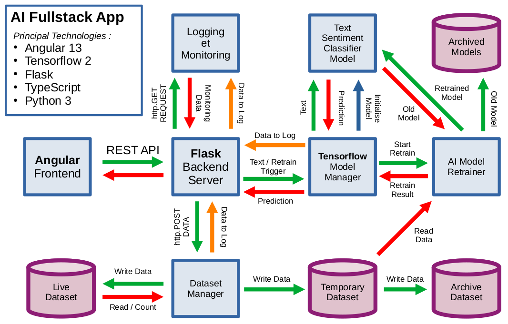
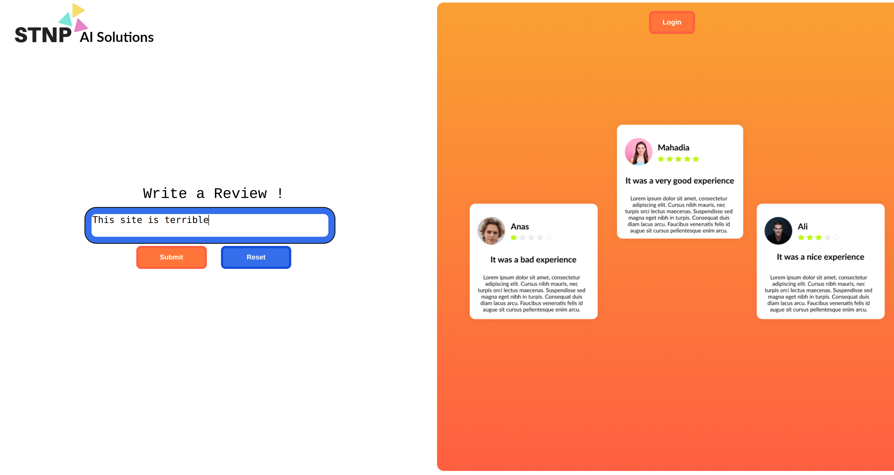
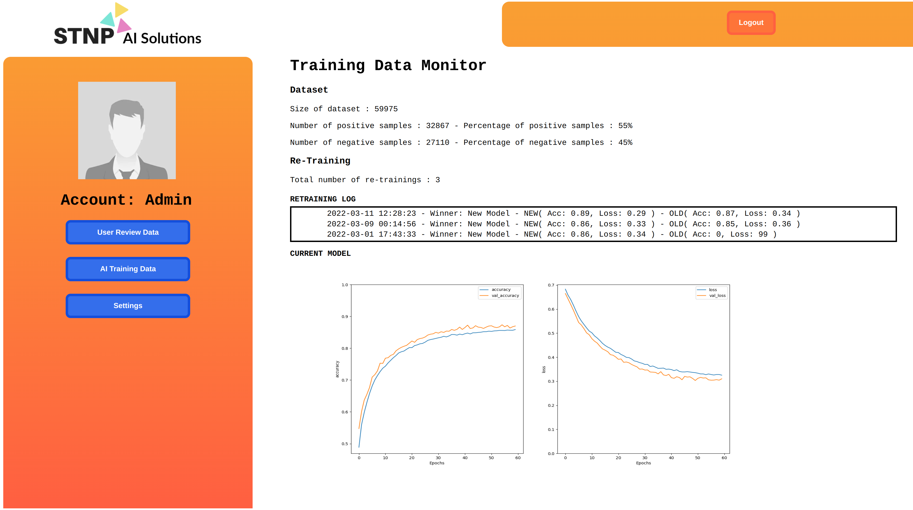

# Fullstack AI Sentiment Classifier

This is a fullstack application I developed to demonstrate a solution for deploying an AI model for classifying online user views. It implements a variety of technologies, the principal frameworks used are Angular 13 for the frontend, Flask for the backend and Tensorflow 2 for the machine learning inference model. Every 1000 reviews the application automatically integrates the new data into the dataset and retrains the model. Potential applications include streamlining user feedback on online marketplaces, like buttons and star ratings no longer necessary to aggregate user opinions of a product.

## Angular Frontend

This is the frontend of the application. In order to run the frontend first run the command `npm install` to install the project dependecies. Then launch with `npm start`. The frontend is built using Angular 13 and TypeScript.

## TF Model Flask

This is a reimplementation of the 'TF Inference Server', using the Flask backend micro-framework. Launch 'tf\_model\_flask/tf\_model\_server.py' to start the Flask server. This provides a RESTful API for running predictions on the AI Model, Adding new records to the dataset and retrieving monitor information. After 1000 new labeled text samples have been added to the dataset the AI retraining process will trigger automatically. The newly trained model will be compared with the old model. If the new model is better the old model will be archived and the new model will go live.

### REST API

#### 1. Make Prediction
- POST:		{action: "predict", text: "I'm lovin it"}
- RESPONSE:	{prediction: "positive", text: "I'm lovin it"}

#### 2. Record Data to Dataset
- POST:		{action: "record", prediction: "positive", text: "I'm lovin it"}
- RESPONSE:	{status: "success"}

#### 3. GET User Data
- GET:		{params: {target: "review_data"}}
- RESPONSE: {total: NUM\_REVIEWS, positive: NUM\_POSITIVE\_REVIEWS, negative: NUM\_NEGATIVE\_REVIEWS}

#### 4. GET Dataset Data
- GET:		{params: {target: "dataset_data"}}
- RESPONSE:	{total: NUM\_SAMPLES, positive: NUM\_POSITIVE\_SAMPLES, negative: NUM\_NEGATIVE\_SAMPLES}

#### 5. GET Re-Training Log Data
- GET:		{params: {target: "log_data"}}
- RESPONSE:	{logs: [ { timestamp: "2022-03-11 12:28:23", winner: "new", old: {loss: 0.32, accuracy: 0.87}, new: {loss: 0.29, accuracy: 0.89} }, ...] }

#### 6. GET Most Recent Training Graph
- GET:		{params: {target: "train_graph"}}
- RESPONSE:	{image: < PNG IMAGE > as binary Blob}

## TF Model Trainer

This contains the cleaned dataset and training algorithm for the TF Sentiment Classifier Model.
